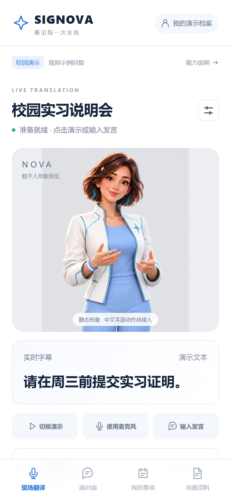
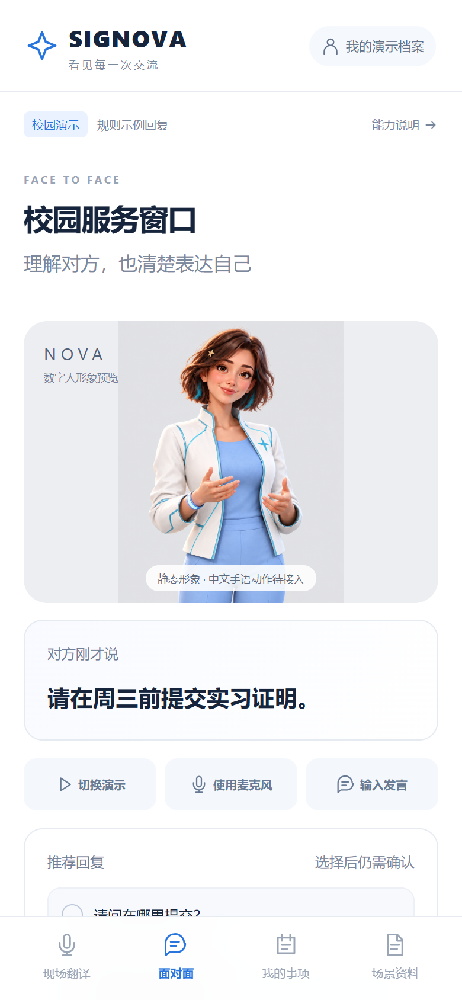
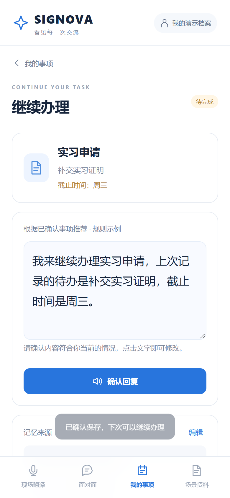
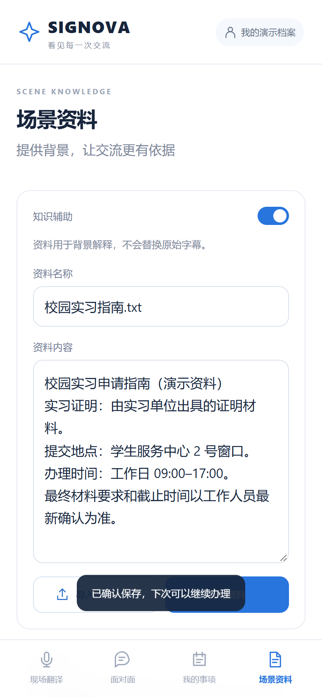

# SIGNOVA · 本地手机端 Demo

三人团队的校园无障碍沟通产品原型。蓝白手机界面与 NOVA 形象；无密钥可体验规则演示；可选接入千问文本模型与阿里云实时语音识别。

## 真实页面截图

以下为实际运行的 Demo 在 390 × 844 手机视口下的浏览器截图，使用校园示例数据。NOVA 为静态形象，推荐回复为规则演示，截图不代表已实现自动手语生成。

| 现场翻译 | 面对面交流 |
| --- | --- |
|  |  |

| 事项记忆与继续办理 | 场景资料 |
| --- | --- |
|  |  |

截图展示当前屏幕范围，页面下方内容可滚动查看。原图保存在 [docs/screenshots](docs/screenshots)。

## 启动

需要 Node.js 22+（建议 24）。首次在此目录执行 `npm install`，然后执行 `npm start`，打开 http://127.0.0.1:5178 。桌面浏览器也可用，窄屏自动适配手机。也可以双击 `启动演示.cmd`。

## 3 分钟体验

1. 现场翻译 → 切换演示 → 说明材料，显示“周三前提交实习证明”。
2. 保存待办 → 核对标题、待办、周三 → 确认保存。
3. 面对面 → 切换演示 → 更正日期，显示“改为周五，不是周三”。
4. 把这件事记下来 → 保存位置选择已有实习事项 → 确认保存。
5. 我的事项 → 继续办理，看到最新日期为周五；展开历史看到周三旧版。
6. 修改回复 → 确认回复 → 大字展示或语音播放。
7. 刷新页面，已确认事项仍在。切换访客不会显示个人事项。

## 能力边界（请在演示中说明）

- **已实现**：可交互手机页面、示例/文字输入、候选回复选择编辑、确认后浏览器 TTS、TXT/MD 资料保存、确认记忆、跨刷新继续办理、日期更正历史、完成/删除事项。
- **默认规则演示**：限定校园词句解析和模板回复，不是实际大模型推理，也不是通用信息抽取。自定义事项请手工核对。
- **可选浏览器语音识别**：依赖浏览器实现、网络及权限，可能发送音频到浏览器服务商。需用户主动同意；不可用时有文字输入。
- **可选真实模型**：生成候选回复、提取待确认事项、建议更新已确认事项。需在“场景资料”主动开启；本轮发言、最近 6 条本次发言、启用的资料会提交给配置的服务。额外开启“允许模型参考我的已确认事项”后，最多发送 6 条相关或近期事项的最新版本，不发送历史版本。访客不发送个人事项。所有保存、更正仍需本人确认。
- **可选云端语音识别**：麦克风音频经本地后端转发到阿里云实时识别，不保存音频。需要有效密钥、浏览器录音权限及安全上下文；单次最多 10 分钟。
- **未实现**：安克实时音频 SDK、中文手语生成/识别、NOVA 骨骼驱动、账号鉴权、跨设备同步。
- NOVA 是**静态形象**。资料页支持自备 MP4/WebM 与完整句子精确匹配播放，仅是视频适配测试，不代表手语内容已核验或通用翻译实现。
- 演示档案仅用 localStorage 保存在当前浏览器，不是安全账户隔离。不要在共享浏览器输入真实敏感资料。访客模式不读取/保存个人事项，但原档案仍保留，可在资料页清除全部数据。

## 接入千问与实时语音识别

1. 在[阿里云百炼控制台](https://bailian.console.aliyun.com/)开通服务，并按[官方说明](https://help.aliyun.com/zh/model-studio/get-api-key)创建 API Key。确认所选模型在你的区域可调用，按平台规则计费。
2. 双击项目目录的 **配置模型.cmd**。它会打开仅本地保存的 **.env**，不会上传密钥。也可复制 **.env.example** 为 **.env**。
3. 把密钥填入 **DASHSCOPE_API_KEY=** 后。默认示例使用北京区域，文本模型 **qwen3.7-plus**，实时识别 **qwen-audio-3.1-asr-flash-streaming**。其他区域需同时调整服务地址和密钥；使用平台控制台提供的匹配地址。
4. 重启服务。进入“场景资料”，点击“测试模型连接”。这会发送一条虚构的校园句子，产生少量模型用量。页面的“已配置”只表示字段齐全，连接测试成功才表示实际调用成功。
5. 勾选“启用模型回复与事项提取”，再输入一条发言。需要利用跨次记忆时，再勾选“允许模型参考我的已确认事项”。两个开关刷新后默认关闭。
6. 如需云端语音，在“语音识别”选择“阿里云实时语音识别”，回到交流页点击“使用麦克风”，确认音频发送后开始。

命令行连接测试：

```powershell
npm run test:connection
```

这个命令会调用真实模型；没有密钥时会明确提示缺少配置。单元和浏览器测试使用模拟响应，不消耗真实模型额度，不构成模型准确率或真实麦克风验收。

**手机录音需要 HTTPS。** 电脑可以通过 http://localhost:5178 测试录音；手机普通局域网 HTTP 只能体验文字流程。配置云端 ASR 也不能绕过浏览器麦克风的安全限制，目前项目未自动配置 HTTPS。

文本模型采用 OpenAI 兼容 Chat Completions 接口，输出 JSON 后由后端验证。AI_BASE_URL / AI_MODEL / AI_API_KEY 可覆盖默认文本服务；文本接口根据地址识别厂商，仅向千问地址发送专用参数；使用其他厂商时还应将 AI_PROVIDER 改为 openai，避免语音服务错误继承文本密钥。语音服务是独立的 DashScope WebSocket 接口，不能通过修改文本模型名来替代。不要把别家模型密钥用于阿里云语音服务。

### 事项提取与更正

模型返回候选事项，不直接写入本地记忆。更正只覆盖明确提供的字段，未提及字段保留已有内容；例如“改为周五，其他不变”仅建议更新日期。若指代不清、没有明确待办，保存弹窗留空供手动填写。模型可能判断错误，必须核对原话及匹配事项。

模型故障、鉴权失败、额度问题或返回格式异常时，页面显示失败原因并退回规则示例，不把回退结果标为真实模型输出。2026-09-29 已在本机配置下完成真实接口联调：新增事项、否定发言、日期更正三条虚构文本用例，以及合成中文音频的云端转写通过。该结果不代表实际场地、噪声或各手机麦克风已验收；换账号或部署环境仍需自行测试。手语生成仍未接入。

参考：[千问结构化输出](https://help.aliyun.com/zh/model-studio/qwen-structured-output) · [实时识别客户端协议](https://help.aliyun.com/zh/model-studio/fun-asr-client-events) · [实时识别服务端协议](https://help.aliyun.com/zh/model-studio/fun-asr-server-events)

## 结构

```
server.mjs          本地静态服务、模型接口与配置状态
model.mjs           千问请求、记忆提取输出校验与安全错误
asr.mjs             阿里云 WebSocket 语音代理
public/asr-client.js 浏览器录音与语音连接
public/pcm-worklet.js 麦克风采样与 PCM16 转换
public/app.js       页面交互与浏览器能力
public/core.js      示例解析与版本化记忆逻辑
public/style.css    手机优先样式
public/assets/      NOVA 和品牌图标
test/core.test.mjs  日期更正、访客边界、版本历史、HTTP 测试
```

执行 `npm test` 和 `npm run check`。可选端到端测试：启动服务，安装或指定 Playwright（环境变量 `PLAYWRIGHT_MODULE` 可指定本地模块路径），再运行 `node scripts/verify-ui.cjs`；需已安装 Chrome。测试使用独立浏览器上下文，不影响当前使用者的数据。模型流程的浏览器测试：指定 Playwright 后执行 `node scripts/verify-model-ui.cjs`，它启动独立临时服务并模拟模型响应。后续优先验证手语展示，再接入正式身份/数据库。不要将长期记忆收益等同于手语动作质量改善。

## 数据与发布

服务默认仅绑定 127.0.0.1。此版本没有用户鉴权或付费接口的生产级访问控制，不应直接作为公开服务部署。开启局域网服务时，仅供可信测试设备使用。代码仓库：https://github.com/Mortalfrank/Signova 。运行数据仍保存在本地浏览器；未加入团队联系方式、论文贡献或公司内部资料。

NOVA 是基于用户提供形象生成的概念素材，手势未作为具体手语核验。保留 `ASSETS.md` 中的来源说明。
